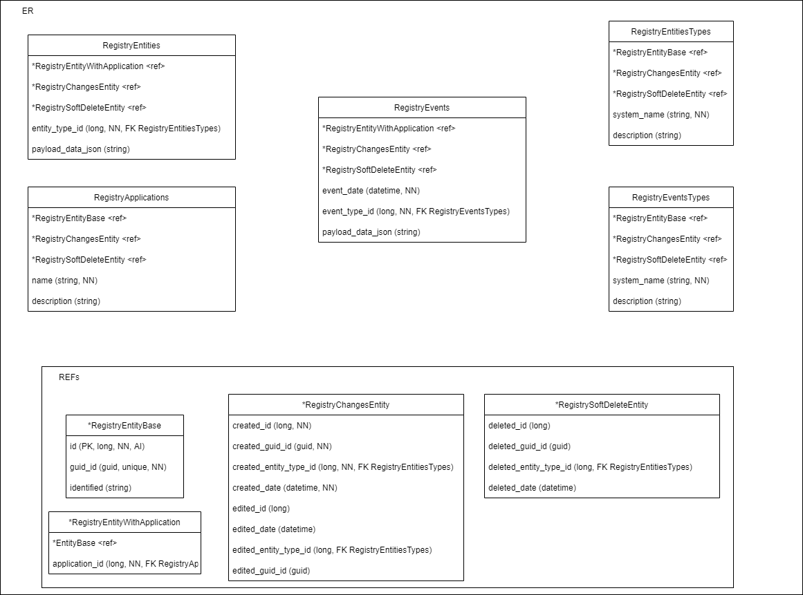
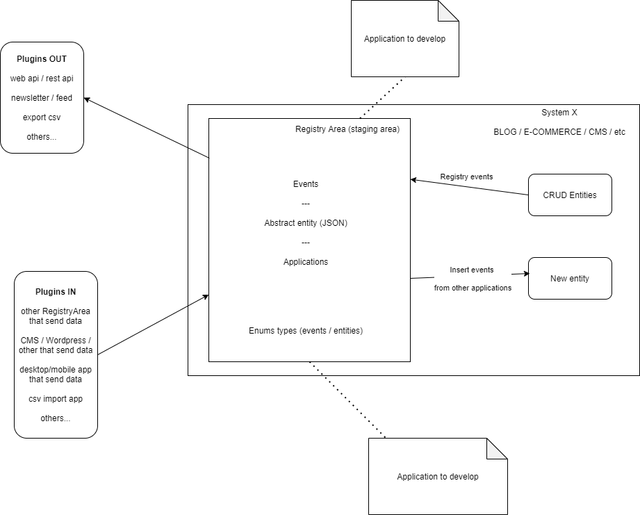
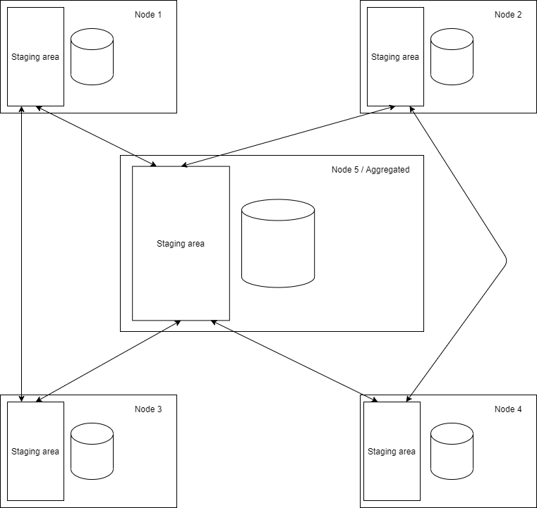

# distributed-shared-data

Sistema per condividere i dati da applicazioni diverse in maniera distribuita.

## L'idea

Realizzare un'infrastruttura di base (una sorta di standard) per distribuire delle informazioni (in maniera astratta, ma con dati specifici che saranno letti da applicativi specifici).

Che siano dati come post, prodotti, offerte di lavoro, ecc, c'è chi crea questi dati (source) e può condividerli (sia in push che in pull) verso altri sistemi che "aggregano" le informazioni. Questi aggregatori sono il core dell'applicativo, la base su cui si struttura la conoscenza.

L'applicativo deve essere modulare (in modo da poter crescere nel tempo, ad esempio una start-up, oppure una persona che crea in autonomia un blog) per poter crescere aggiungendo plug-in per avere più sorgenti dati esterni e più output e partendo dal solo producer di dati diventare un consumer/aggregatore.

## Entità Relazioni

## Casi d'uso

### Blog Diffuso

Una serie di blog interconnessi uno all'altro tranute webapi/restapi e RegistryArea per scambiarsi aggiornamenti reciproci, post, categorie, commenti, ecc.

### CMS

Una serie di CMS interconnessi per scambiarsi contenuti:
- alcuni client potrebbero solo mandare contenuti preformattati
- ci potrebbero essere una serie di frontend che ricevono solo i contenuti, li aggrega (secondo delle logiche) e li visualizza

### E-commerce

Una serie di e-commerce che si scambiano prodotti/ordini e potrebbero generare delle fatture fra di loro nel caso di vendite reciproche:
- client che permettono di inviare i prodotti in vendita e ricevono gli ordini di quelli venduti
- possibilità di avere un dato GEO per localizzare dove si trova un determinato prodotto

## Gli elementi del sistema

### Core/Aggregatore

E' la base del sistema, ha in se il database (o file) che immagazzina le informazioni.
Deve essere visto come un componente all'interno dell'applicativo (sia esso un blog/cms/ecommerce/ecc) che ha un sistema che permette due operazioni principali:

- registry area: serve a registrare le operazioni che avvengono all'interno dell'applicazione salvandole nel database
- staging area: serve a ricevere e registrare le operazioni che vengono da applicativi esterni, e permette poi di visualizzarli e importarli nell'applicazione

#### Esempio

Può essere ad esempio un monolite che è sia Producer/Aggregatore/Consumer.

### Consumer

E' un applicativo che legge i dati dalla sorgente (DB / File / BE / RestAPI) e li visualizza.

#### Esempio

Può essere ad esempio un applicativo frontend che legge un file di testo, una webapi, o direttamente un database e ne visualizza il contenuto.

### Aggregatore

Unisce una o più fonti dati trasformandola in una singola e permettendo ai Consumer di leggerla.

#### Esempio

Può essere ad esempio un applicativo backend che recupera le informazioni da fonti esterne (ad esempio tramite un batch che sincronizza) e va ad alimentare un database interno per poi essere disponibile ai suoi consumer.

### Producer

E' un applicativo che permette di inserire dati nel sistema (sia che sia interna ad esso, sia che vengano inviate ad un applicativo esterno).

#### Esempio

Può essere ad esempio un applicativo amministrativo che permette l'inserimento dei dati nel database.

## Esempi di implementazione

### Implementazioni in dotnet

- https://github.com/MagicianredLabs/dotnet-distributed-shared-data

#### Alcuni siti che la implementano

- https://github.com/Magicianred/magicianred-net-website
- https://github.com/Magicianred/dotnet5-example-blog
